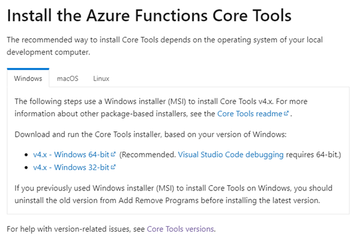

# RBAC Error 처리


1. 로그에 출력된 해당 링크로 이동합니다.
- [URL 링크](https://aka.ms/azfunc-install)

2. 해당 페이지에서 Install the Azure Functions Core Tools를 찾아 OS에 맞는 버전으로 다운로드 후 설치를 진행합니다.



3. VSCode Tool을 종료 후 다시 켜서 터미널에 다시 Function 실행 명령어를 입력 후 정상적으로 동작하는지 확인합니다. 

```powershell
mvn azure-functions:run
```

- `주의` : 자바 환경변수에 JAVA_HOME이 등록되지 않으면 아래와 같은 로그가 발생하면서 Function이 동작하지 않으므로 주의바람

