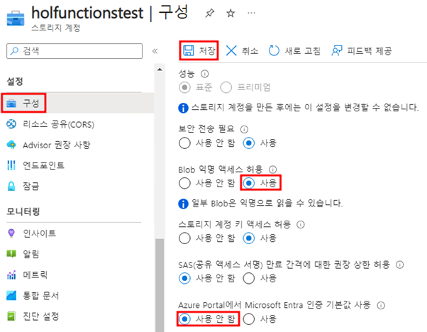
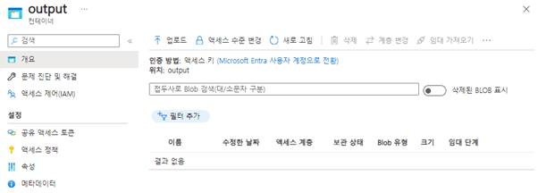

# Microsoft Entra ID 권한문제 해결

1. 해당 스토리지 계정의 “구성”으로 들어가 “Blob 익명 액세스 허용”을 “사용”으로 “Azure Portal에서 Microsoft Entra 인증 기본값 사용”에서 “사용 안함”을 체크 후 “저장"을 눌러 저장합니다.

- Blob 익명 액세스 허용 : 이미지를 다운로드 하기 위해 사용으로 체크	

2. 다시 컨테이너로 들어가 동일한 에러가 발생하는지 다시 확인합니다.

