# TASK 1.HttpTrigger 생성

1.	WORKSPACE에 있는 Create Function 아이콘을 클릭합니다.

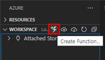

2.	작업할 위치 디렉토리를 선택합니다

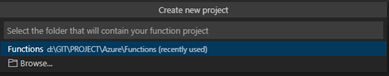

3.	Java를 선택합니다.

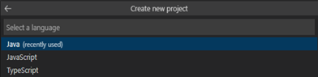

4.	설치된 JDK버전에 따라 Java 버전을 선택합니다.

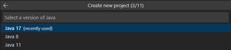

5.	사용할 그룹 아이디를 지정합니다.

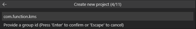

6.	사용할 Functions의 id를 입력합니다.

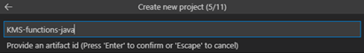

7.	스냅샷 파일명을 지정합니다.

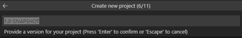

8.	Java 패키지명을 지정합니다.

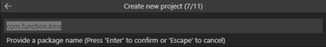

9.	Functions에서 사용할 App Name을 지정합니다.

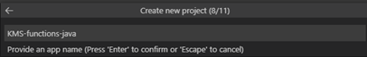

10.	Maven을 선합니다.

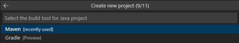

11.	Maven 빌드가 완료될 때까지 기다립니다.

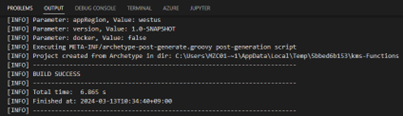

12.	아래 이미지와 같이 Local Project가 생성되면 성공입니다.

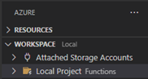