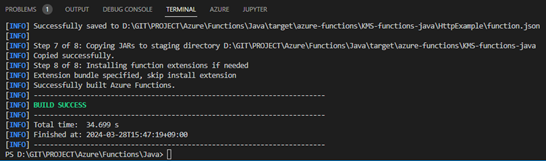
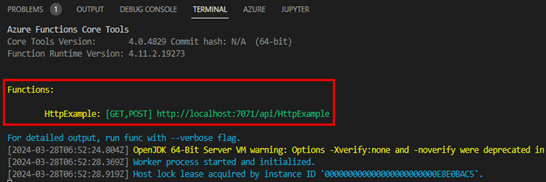
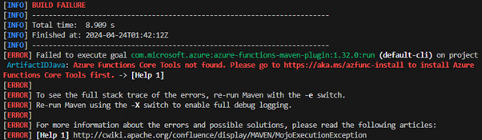
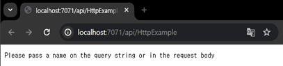
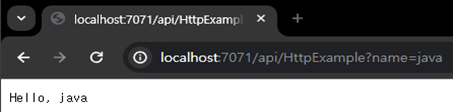
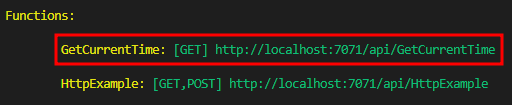
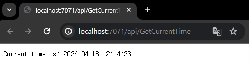

# TASK 2.httpTrigger 로컬환경 실행
1.	터미널에서 다음과 같은 명령어를 입력해 프로젝트를 maven명령어로 build작업을 진행합니다.

```powershell
mvn clean package
```


2.	다음 명령어를 입력해 로컬에서 function을 동작 시킵니다.

```powershell
mvn azure-functions:run
```

3.	명령어 입력 후 제공되는 로컬url을 복사하여 간단한 테스트를 진행합니다.


    - `주의사항`
    > 빌드 후 실행 명령어에서 아래 이미지와 동일한 에러가 발생하는 경우   
    [링크](https://github.com/IIBlackCode/Azure_Function_Hol/blob/master/Document/ERROR/LAB2/task2.md)를 클릭하여 다음 과정을 수행해주시길 바랍니다.   
    (에러가 발생하지 않은 경우 `skip`)

    

4.	크롬 브라우저를 열어 복사한 url을 입력 후 get방식으로 파라미터를 전달합니다.
- http://localhost:7071/api/HttpExample?name=java



5.	아래 이미지와 같이 Hello, java가 확인되면 성공입니다.



6.	http 트리거에 현재 시간을 알려주는 코드를 추가합니다.
```java
import java.text.SimpleDateFormat;
import java.util.Calendar;

    @FunctionName("GetCurrentTime")
    public HttpResponseMessage run2(
            @HttpTrigger(name = "req", methods = {HttpMethod.GET}, 
                        authLevel = AuthorizationLevel.ANONYMOUS) 
                        HttpRequestMessage<Optional<String>> request,
            final ExecutionContext context) {
        context.getLogger().info("Java HTTP trigger processed a request.");

        // 현재 시간을 가져오기 위해 Calendar 객체 사용
        Calendar cal = Calendar.getInstance();
        SimpleDateFormat sdf = new SimpleDateFormat("yyyy-MM-dd HH:mm:ss");
        String currentTime = sdf.format(cal.getTime());

        return request.createResponseBuilder(HttpStatus.OK).body("Current time is: " + currentTime).build();
    }
```

7.	터미널에서 ctrl+c를 눌러 기존 작업 종료 후 maven명령어를 이용해 build작업 후 function을 실행합니다.

```powershell
mvn clean package
mvn azure-functions:run
```

8.	새로 추가되는 url을 클릭해서 브라우저를 확인합니다.



9.	해당 url에 접속하여 현재시간을 확인합니다. [완료]

