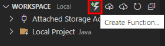
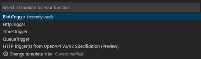
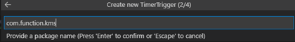
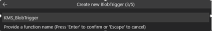
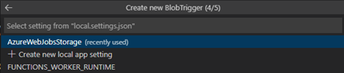
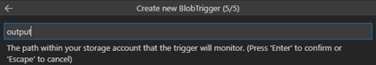

# TASK 3.	BlobTrigger 추가
1.	Create Function… 버튼을 클릭해서 Function 생성작업을 진행합니다.
 

2.	BlobTrigger를 선택합니다.
 

3.	패키지 경로를 입력합니다.
 

4.	BlobTrigger의 이름(BlobTriggerJava-OUTPUT)을 지정합니다.
 

5.	스토리지 계정과 연동할 환경변수를 선택합니다. (AzureWebJobsStorage)
 

6.	사용할 컨테이너명을 입력합니다. (output)
 

7.	BlobTrigger 추가가 완료되었습니다. [완료]

