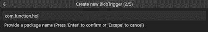
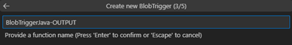

# TASK 3.	BlobTrigger 추가
1.	Create Function… 버튼을 클릭해서 Function 생성작업을 진행합니다.
 

2.	BlobTrigger를 선택합니다.
 

3.	패키지 경로를 입력합니다.
 

4.	4.	BlobTrigger명을 `BlobTriggerJava-OUTPUT`로 입력합니다.

    
    주의 : 해당 명칭은 Java클래스명으로 등록됩니다. 
    따라서 Java 문법상 첫글자는 `대문자`로 입력할 것을 권장드립니다.

5.	스토리지 계정과 연동할 환경변수를 선택합니다. (`AzureWebJobsStorage`)
 

6.	사용할 컨테이너명을 output으로 입력해서 BlobTrigger생성을 완료합니다.[완료]
 
