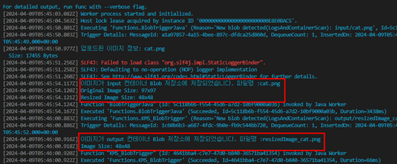
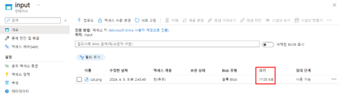
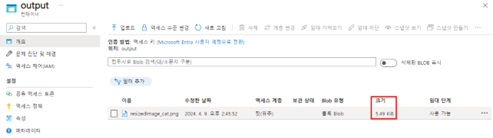

# TASK 2.BlobTrigger 이미지 리사이징 테스트
1.	기존에 Function이 동작 중이라면 Ctrl+c를 눌러 작업을 종료한 다음 mvn 명령어를 통해 build 후 실행시킵니다.
- Build
```powershell
mvn clean package
```
- Function 실행
```powershell
mvn azure-functions:run
```
2.	Azure Portal에 접속하여 input컨테이너에 이미지를 업로드 후 리사이징 처리되는 로그를 확인합니다.



3.	Azure Portal에 접속하여 input컨테이너와 output컨테이너에 업로드 된 이미지 크기를 확인합니다. [완료]
- input 컨테이너
  
    

- output 컨테이너
  
    
