# TASK 3.HttpTrigger, BlobTrigger 배포

1.	Ctrl + Shift + P를 눌러 팔레트를 열어 Azure Functions: Create Function App in Azure…를 선택합니다.
 
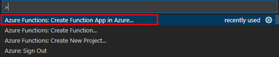

2.	배포대상 구독을 선택합니다.
 
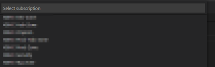

3.	Azure Portal에 배포될 Functions리소스명을 입력합니다.
 
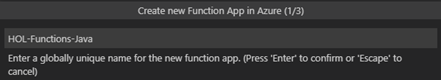

4.	로컬 JDK버전에 맞는 버전을 선택합니다.
 
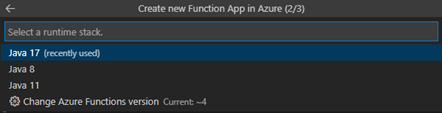

5.	Korea Central로 배포 리전을 선택합니다.
 
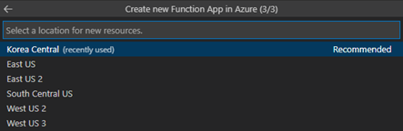

6.	터미널 로그를 통해 배포 진행과정을 확인합니다.
 

7.	WORKSPACE의 Deploy버튼을 클릭해서 “Deploy to Function App”을 클릭합니다.
 
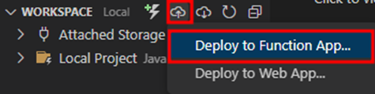

8.	Function 생성시 선택했던 구독을 다시 선택합니다.
 
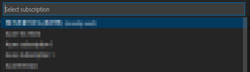

9.	생성한 Function 리소스를 선택합니다.
 
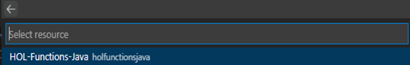

10.	Deploy를 클릭하여 기존 생성한 리소스에 덮어써서 배포를 진행합니다.
 
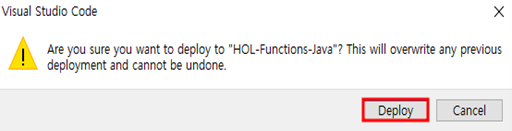

11.	배포 진행과정을 모니터링하면서 완료를 기다립니다.
	터미널 로그를 통해 build과정을 모니터링합니다.
 
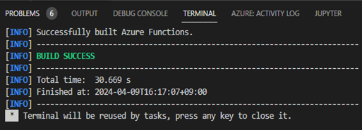

	해당 구독에 생성된 리소스 중 Function App을 열어 배포여부를 관찰합니다.
 
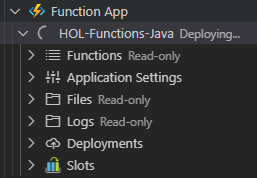

12.	배포가 진행되면서 Azure Portal에 새로 생성된 리소스 리스트를 확인합니다.
 
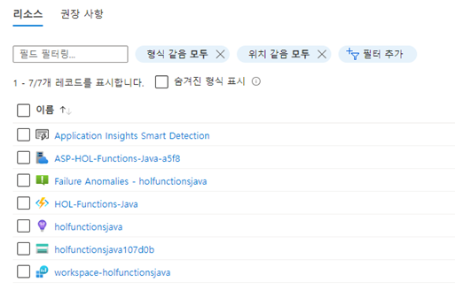

13.	리소스 리스트 중 blob트리거를 배포하면서 생성된 스토리지 계정(holfunctionsjava*****)에 input컨테이너와 output컨테이너를 생성합니다.
 
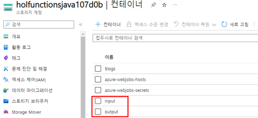

14.	생성한 Functions리소스로 접근하여 생성된 트리거 리스트를 확인합니다.
    1. HOL-Functions-Java를 클릭합니다.

        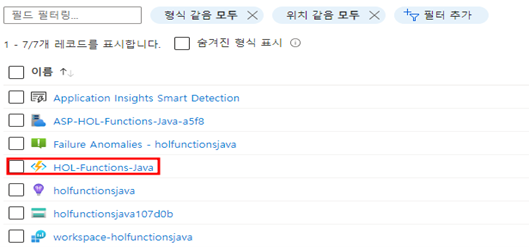 

    2. 생성한 트리거 리스트를 확인합니다.

        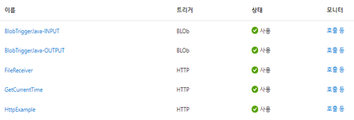
