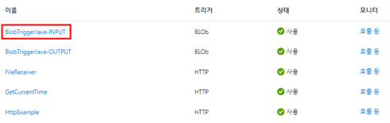
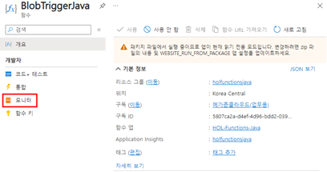
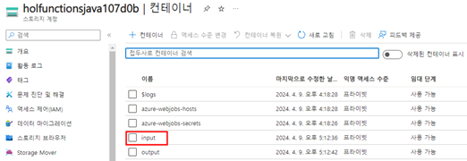
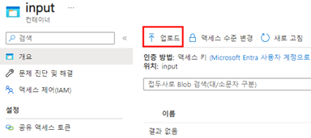
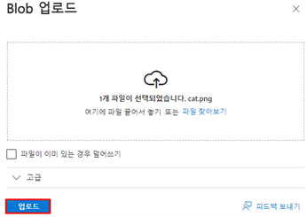
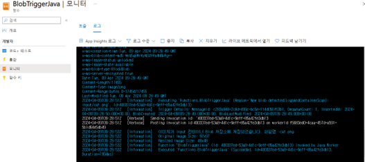

# TASK 4.Azure Portal BlobTrigger 테스트
1.	트리거 리스트 중 BlobTriggerJava를 클릭합니다.
 

2.	모니터를 클릭해 로그를 지속적으로 확인합니다.
 

3.	다른 브라우저 창을 열어 스토리지 계정(holfunctionsjava107d0b)에서 input 컨테이너를 클릭합니다.
 

4.	업로드를 클릭해서 이미지를 업로드 테스트를 진행합니다.
 

5.	파일 찾아보기를 클릭해서 테스트할 이미지를 선택 후 업로드를 클릭합니다.
 

6.	이미지 업로드 완료 후 실행해 놓은 BlobTriggerJava 모니터를 통해 파일 리사이징 로그를 관찰합니다.
 

7.	스토리지 계정(holfunctionsjava107d0b)에서 output 컨테이너에 리사이징 된 이미지를 다운로드 받아 실제 이미지 사이즈에 변화가 있는지 확인합니다. [완료]

