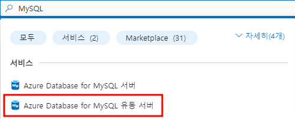
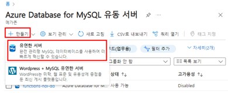
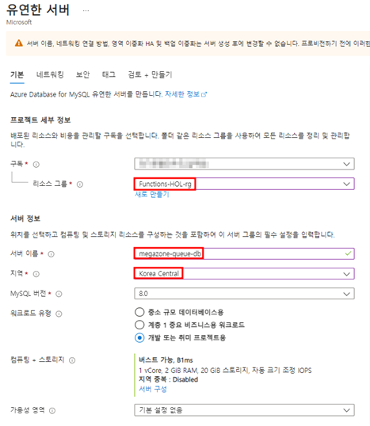
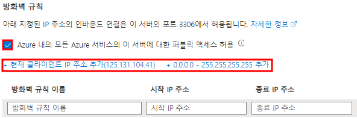
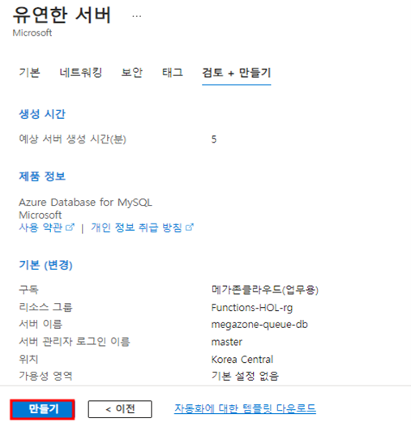
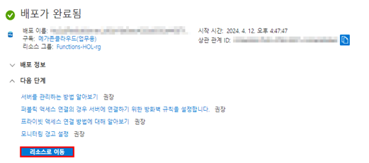
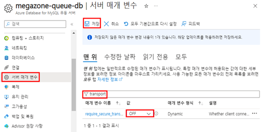

# TASK 1.MySQL Database 생성
1.	Azure Portal에 접속 후 MySQL을 검색 후 “Azure Database for MySQL 유동 서버”를 선택합니다.
 

2.	“+만들기”를 클릭해서 “유연한 서버”를 클릭하여 리소스 생성 작업을 진행합니다.
 

3.	“기본” 탭에서 아래 내용을 참고하여 입력 후 나머지는 기본을 선택해서 작성합니다. (이미지 참고)
    1.	리소스 그룹 : 기존 스토리지 계정을 생성 시 추가된 리소스그룹을 선택합니다.
    2.	서버 이름 : 사용할 Database명을 입력합니다.
    3.	지역 : Korea Central을 선택합니다.
    4.	인증 방법 :  MySQL 인증만을 선택합니다.
    5.	관리자 사용자 이름 : 사용할 DB계정을 입력합니다.
    6.	암호 : 사용할 DB 비밀번호를 입력합니다.

작성 후 “다음: 네트워킹” 버튼을 클릭합니다.

4.	`“네트워크”` 탭에서 “`Azure 내의 모든 Azure 서비스의 이 서버에 대한 퍼블릭 액세스 허용`”에 체크를 한 후 “`현재 클라이언트 IP 주소 추가`”를 눌러 IP를 추가합니다.

“`검토 + 만들기`”를 클릭하여 다음으로 넘어갑니다.

5.	“`검토 + 만들기`” 탭에서 “`만들기`”를 클릭해서 리소스 생성 작업을 진행합니다.
 

6.	배포가 완료되면 “`리소스로 이동`”을 클릭해서 개요로 이동합니다.
 

7.	“`서버 매개 변수`”로 이동해서 “`transport`”를 검색한 다음 값을 “OFF”로 수정 후 “`저장`”을 클릭해서 수정된 매개 변수를 저장합니다. [완료]
 

