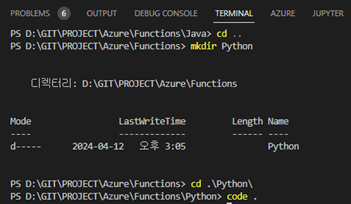
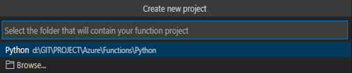
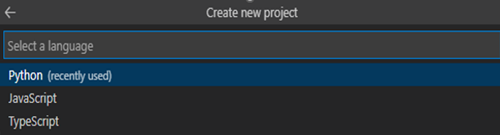
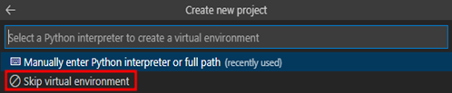
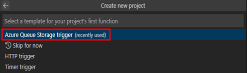
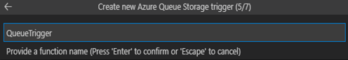
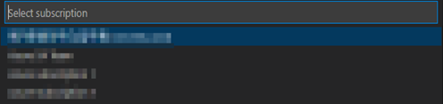
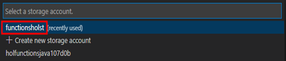
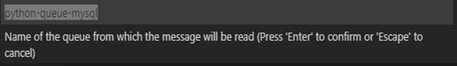
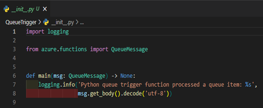

# TASK 2.QueueTrigger 생성
1.	터미널에서 기존 경로와 다른 새로운 경로를 생성 후 아래 명령어를 통해 새로운 작업환경을 구성합니다.

```powershell
cd : 새로운 경로로 이동
code . : 새 작업환경 열기
```



2.	Java에서 Function을 추가했던 것과 마찬가지로 아래 이미지에서 보이는 “Create Function” 버튼을 클릭합니다.
 


3.	현재 디렉토리를 선택 후 엔터를 입력합니다.
 


4.	Python을 선택 후 엔터를 입력합니다.
 


5.	Skip virtual environment를 선택해서 넘어갑니다.
 


6.	Azure Queue Storage Trigger를 선택합니다.
 


7.	사용할 트리거의 대표 이름을 입력 후 엔터를 입력합니다.
 


8.	Create new local app setting을 선택합니다.
 


9.	사용할 구독을 선택합니다.
	단, 기존에 스토리지 계정이 배포된 구독을 선택 합니다.
 


10.	로컬에서 Java Function작업시 사용했던 스토리지계정을 선택합니다.
 


11.	스토리지 계정에 생성될 큐에 대한 명칭을 지어줍니다.
	python-queue-mysql
 


12.	Python코드로 이루어진 QueueTrigger생성이 완료되었습니다.[완료]
 

