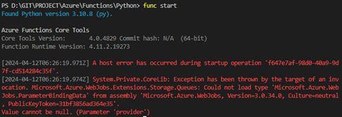
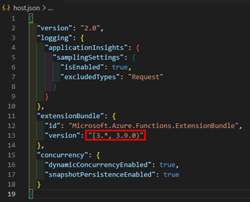
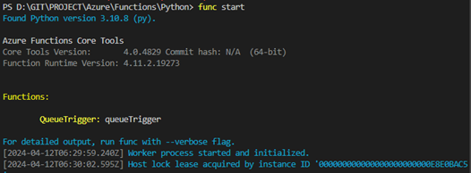
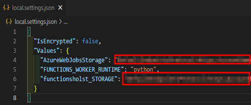
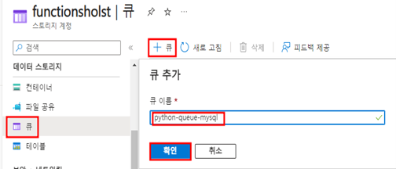
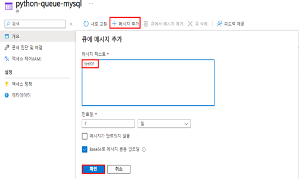

# TASK 3.QueueTrigger 로컬환경 실행

- Python 트리거 실행 명령어
func start

1.	트리거를 실행 시 아래 이미지와 같은 에러가 발생하는 경우 [하단 이미지 참조]
 


- QueueTrigger 실행 전 host.json파일에서 이미지에 표시된 버전과 동일한 버전으로 수정합니다.
- 기존 버전 > "[3.*, 3.9.0)" 버전으로 수정



- 수정 후 재실행



2.	function.json파일 수정
	function.json파일에서 connection이 “functionsholst_STORAGE”로 되어있으나 배포 시 AzureWebJobsStorage에서 스토리지 연결 문자열이 저장되기 때문에 connection을 AzureWebJobsStorage로 미리 변경합니다.
 


3.	local.setting.json파일 수정
	로컬에서 테스트 진행 시 local.setting.json에서 환경변수를 사용하기 때문에 비어있는 AzureWebJobsStorage변수에 functionsholst_STORAGE에 저장된 스토리지 연결 문자열을 똑같이 복사해서 넣어줍니다.
 


4.	위 세개의 파일을 수정 후 터미널에서 다시 트리거를 실행합니다.
- Python 트리거 실행 명령어
```powershell
func start
```

5.	기존 스토리지 계정에서 “큐”를 클릭한 후 “+큐”를 눌러 QueueTrigger 생성 시 지어준 큐 이름(python-queue-mysql)으로 큐를 생성합니다.
 


6.	해당 큐를 클릭해서 “+메시지” 버튼을 누르고 메시지를 추가합니다.
 


7.	메시지 추가 시 아래 이미지와 같은 python코드에 의해 생성된 로그를 확인할 수 있습니다.
 

