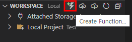
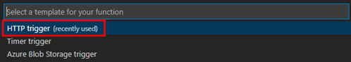
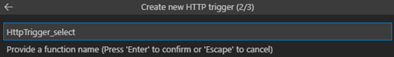
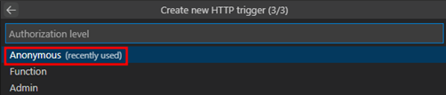
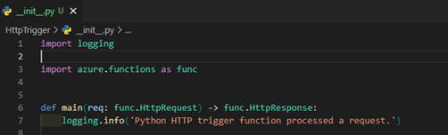

# TASK 4.데이터 인입 확인을 위한 http트리거 추가
1.	“Create Function” 버튼을 클릭합니다.
 


2.	현재 디렉토리를 선택 후 엔터를 입력합니다.



3.	http트리거에 사용할 이름을 작성합니다.



4.	Anonymous를 선택해서 http트리거 생성을 완료합니다.



5.	http트리거 생성이 완료되었습니다.



6.	http트리거 생성 후 __init__.py파일의 코드를 다음과 같이 수정합니다.
- 데이터베이스 생성 시 사용되는 정보들을 아래 코드의 주석(# 데이터베이스 정보)에 있는 값에 동일하게 입력합니다.
```python
import logging
import mysql.connector
import azure.functions as func

def main(req: func.HttpRequest) -> func.HttpResponse:
    logging.info('Python HTTP trigger function processed a request.')

    # 데이터베이스 정보
    host = "<<DB HOST NAME>>"
    port = 3306
    user = "<<DB USER NAME>>"
    password = "<<DB PASSWORD>>"
    database = "<<DB NAME>>"
    table = "<<DB TABLE NAME>>"

    # Data SELECT
    rows = select_table(host, port, user, password, database, table)
    return func.HttpResponse("\n".join([str(item[0])+", "+str(item[2])+"\n" for item in rows]),status_code=200)

def select_table(host, port, user, password, database, table):
    logging.info("SELECT DATA")
    # MySQL 데이터베이스에 연결
    conn = mysql.connector.connect(
        host=host,
        port=port,
        user=user,
        password=password,
        database=database,
    )

    cursor = conn.cursor()
    # 메시지 데이터를 MySQL에 삽입
    select_query = f"""SELECT * FROM {table}"""
    cursor.execute(select_query)
    
    # SELECT 쿼리의 결과를 반환
    rows = cursor.fetchall()
    
    # 연결 종료
    cursor.close()
    conn.close()
    logging.info(rows)
    return rows
```