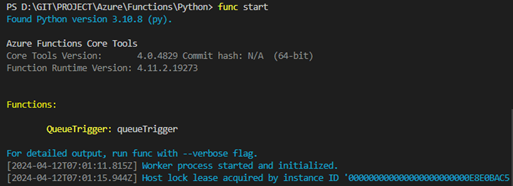

# TASK 5.코드 수정 및 테스트
1.	라이브러리 설치를 위해 requirements.txt파일을 다음과 같이 수정합니다.

```powershell
azure-functions
azure-storage-queue
mysql-connector-python
```

2.	Requirements.txt파일에 추가된 라이브러리를 설치하기 위해 터미널에서 아래에 있는 명령어를 실행합니다.

```powershell
pip install -r requirements.txt
```

3.	다음 이미지와 같이 QueueTrigger폴더를 열어 __init__.py에 작성된 파이썬 코드를 다음과 같이 수정합니다.
```python
import logging
import mysql.connector
from azure.functions import QueueMessage

def main(msg: QueueMessage) -> None:
    logging.info('Python queue trigger function processed a queue item: %s', msg.get_body().decode('utf-8'))
    
    # message 정보 읽어오기
    message_body = msg.get_body().decode('utf-8')
    message_id = msg.id
    message_receipt = msg.pop_receipt
    logging.info("message context : %s", message_body)
    logging.info("message_id : %s", message_id)
    logging.info("message_receipt : %s", message_receipt)

    # 데이터베이스 정보
    host = "<<DB HOST NAME>>"
    port = 3306
    user = "<<DB USER NAME>>"
    password = "<<DB PASSWORD>>"
    database = "<<DB NAME>>"
    table = "<<DB TABLE NAME>>"

    # 데이터베이스 생성
    create_database(host, port, user, password, database)

    # 테이블 생성
    create_table(host, port, user, password, database, table)

    # Data INSERT
    insert_table(host, port, user, password, database, table, message_id, message_body)

    # Data SELECT
    select_table(host, port, user, password, database, table)

def create_database(host, port, user, password, database):
    # MySQL 데이터베이스에 연결
    logging.info("CREATE DATABASE")
    conn = mysql.connector.connect(
        host=host,
        port=port,
        user=user,
        password=password,
    )

    cursor = conn.cursor()

    # 데이터베이스 생성 쿼리 실행
    create_database_query = f"CREATE DATABASE IF NOT EXISTS {database}"
    cursor.execute(create_database_query)

    # 연결 종료
    cursor.close()
    conn.close()

def create_table(host, port, user, password, database, table_name):
    logging.info("CREATE TABLE")
    # MySQL 데이터베이스에 연결
    conn = mysql.connector.connect(
        host=host,
        port=port,
        user=user,
        password=password,
        database=database,
    )
    cursor = conn.cursor()

    # 테이블이 존재하는지 확인하고 없으면 생성
    cursor.execute(f"SHOW TABLES LIKE '{table_name}'")
    result = cursor.fetchone()
    if not result:
        # 테이블 생성 쿼리 실행
        create_table_query = f"""
        CREATE TABLE IF NOT EXISTS {table_name} (
            id INT AUTO_INCREMENT PRIMARY KEY,
            message_id VARCHAR(255),
            message_body TEXT
        )
        """
        cursor.execute(create_table_query)
        logging.info("테이블 생성이 완료되었습니다.")

    # 연결 종료
    cursor.close()
    conn.close()

def insert_table(host, port, user, password, database, table, message_id, message_body):
    logging.info("INSERT DATA")
    # MySQL 데이터베이스에 연결
    conn = mysql.connector.connect(
        host=host,
        port=port,
        user=user,
        password=password,
        database=database,
    )

    cursor = conn.cursor()
    # 메시지 데이터를 MySQL에 삽입
    insert_query = f"""INSERT INTO {table} (message_id, message_body) VALUES (%s, %s)"""
    insert_values = (message_id, message_body)
    cursor.execute(insert_query, insert_values)
    conn.commit()
    # 연결 종료
    cursor.close()
    conn.close()

def select_table(host, port, user, password, database, table):
    logging.info("SELECT DATA")
    # MySQL 데이터베이스에 연결
    conn = mysql.connector.connect(
        host=host,
        port=port,
        user=user,
        password=password,
        database=database,
    )

    cursor = conn.cursor()
    # 메시지 데이터를 MySQL에 삽입
    select_query = f"""SELECT * FROM {table}"""
    cursor.execute(select_query)
    
    # SELECT 쿼리의 결과를 반환
    rows = cursor.fetchall()
    
    # 연결 종료
    cursor.close()
    conn.close()
    logging.info(rows)
```

4.	터미널에서 다시 트리거를 실행합니다.
- Python 트리거 실행 명령어

```powershell
func start
```
