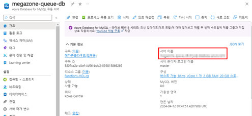
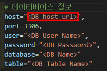
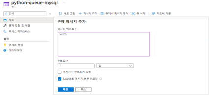
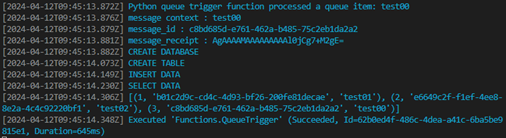

# TASK 6.QueueTrigger 테스트

1.	개요에 있는 “서버 이름”의 URL을 복사하여 수정된 파이썬 코드에 있는 DB정보의 host에 붙여 넣고 다른 정보도 함께 입력합니다.
    A.	서버 이름 복사
    
    

    B.	http트리거와 QueueTrigger에 있는 __init__.py의 데이터베이스 정보 host변수에 붙여 넣고 나머지도 MySQL 생성 시 사용했던 정보들로 입력 후 function을 로컬에서 실행합니다.

    

2.	큐(python-queue-mysql)로 돌아가 다시 한번 “+메시지 추가”를 클릭하여 메시지를 추가 후 터미널에서 해당 로그를 확인합니다.

    A.	큐에 메시지를 추가합니다.

    

    B.	터미널 로그를 확인. [완료]

    

    - 큐에 메시지를 추가하면서 해당 데이터베이스에 정상적으로 데이터 Insert가 확인됩니다.
