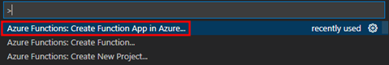
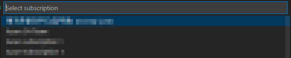
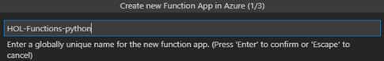
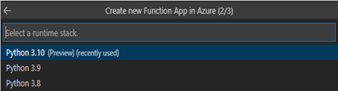
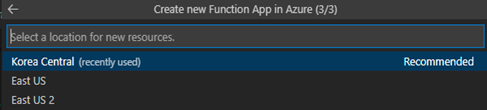
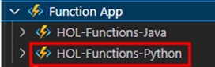

# TASK 1.	Azure Portal Function 생성

1.	Ctrl+Shift+P을 열어 팔레트를 켠 후 팔레트에서 아래 이미지에 표시된 부분을 선택합니다.
 

2.	기존과 같은 구독을 선택합니다.
 

3.	배포할 리소스 이름을 작성합니다.
 

4.	로컬 환경과 비슷한 버전을 선택합니다.
 

5.	해당 리전을 Korea Central로 선택합니다.
 

6.	해당 구독 하위 디렉토리에서 생성한 Function이 조회되는지 확인합니다. [완료]
 

