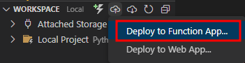
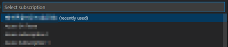
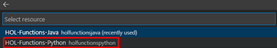
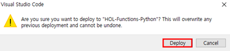
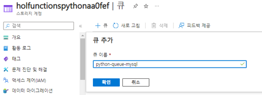
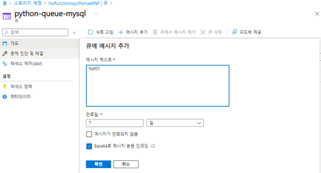
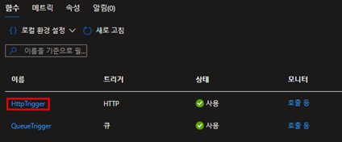
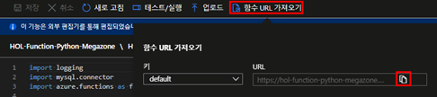
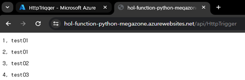

# TASK 2.	Python QueueTrigger 배포 및 데이터 확인

1.	다음 화면에서 Deploy버튼을 눌러 이미지에 표시된 부분을 클릭합니다.
 

2.	기존과 동일한 구독을 선택합니다.
 

3.	Task1에서 생성한 리소스를 선택합니다.
 

4.	Deploy버튼을 눌러 배포를 진행합니다.
 

5.	새 브라우저를 열어 기존에 작업한 Function을 생성하면서 자동으로 생성된 스토리지에 같은 이름의 큐를 생성합니다.
 

6.	해당 큐로 진입해 메시지를 추가합니다.
 

7.	Function화면으로 전환해서 생성한 Http트리거를 클릭합니다.
 

8.	“함수URL가져오기”를 클릭 후 “클립보드 복사”버튼을 눌러 URL을 복사한 다음 테스트할 새 브라우저에 URL을 붙여넣어 큐에 추가한 메시지 리스트를 확인합니다.
 

9.	완료

